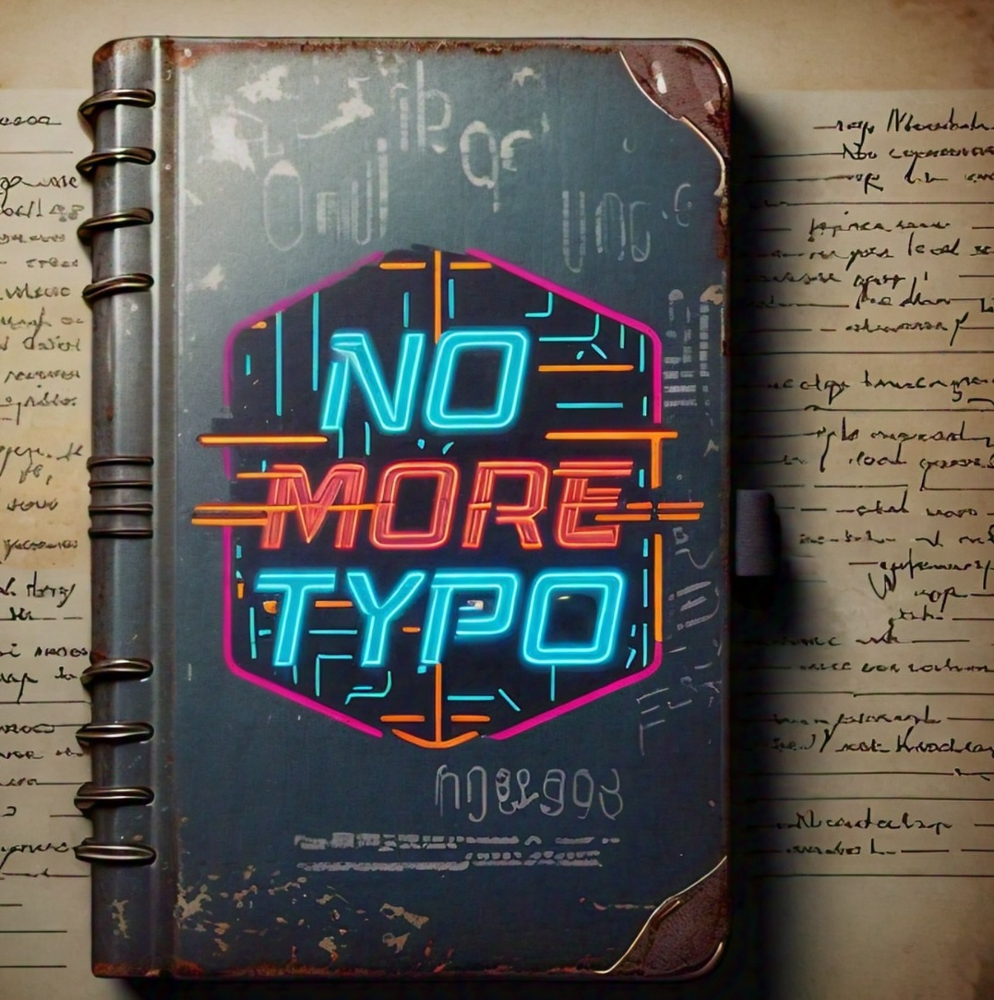

# ClipIQ - Intelligent Clipboard Processing

> **Formerly known as no_more_typo** - Now evolved into ClipIQ, the intelligent clipboard assistant



**ClipIQ by devquasar.com transforms your clipboard into an AI-powered text processing powerhouse. Copy text with commands, press a hotkey, and get intelligent results instantly - works with any application.**

## 🚀 Quick Start

### Download & Run (macOS Only)
```bash
# 1. Download the standalone executable (macOS only)
wget https://github.com/yourusername/no_more_typo/raw/feature/clipiq-rebranding/dist/clipiq

# 2. Make executable
chmod +x clipiq

# 3. Set your OpenAI API key
export OPENAI_API_KEY="your-openai-api-key-here"

# 4. Run ClipIQ
./clipiq

# 5. Use intelligent processing
# Copy text with commands → Press Ctrl+Shift+Z → Get AI-enhanced results
```

#### 🔒 macOS Security Settings
When first running ClipIQ, macOS may block the executable. To allow it:

1. **Try to run ClipIQ** - macOS will show a security warning
2. **Open System Settings**: Apple menu → System Settings
3. **Go to Privacy & Security** (scroll down in sidebar if needed)
4. **Click "Open Anyway"** (appears for ~1 hour after the warning)
5. **Enter your password** and click OK
6. **ClipIQ will now run** without further security prompts

> **Note**: This is standard for all unsigned macOS applications. ClipIQ is safe but not code-signed.

## ✨ What ClipIQ Does

### 🧠 Intelligent Commands
Transform text instantly with natural command syntax:

```
"Hello world <#translate to spanish>"     → "Hola mundo"
"def func(): pass <#complete>"            → Complete function implementation
"Machine learning <#explain simply>"     → Beginner-friendly explanation  
"Buggy code <#fix errors>"              → Clean, corrected code
"Short text <#elaborate>"                → Detailed expansion
"Long article <#summarize>"              → Concise summary
"Any task <#custom instruction>"         → Generic AI processing
```

### 🎯 Universal Compatibility
ClipIQ works with **any application**:
- ✅ Email clients (Gmail, Outlook, Apple Mail)
- ✅ Code editors (VS Code, Sublime, Vim) 
- ✅ Chat apps (Slack, Discord, Teams)
- ✅ Documents (Word, Google Docs, Notion)
- ✅ Browsers (any website with text input)
- ✅ **Every app on your system!**

### 🔄 Backward Compatible
- Regular text without commands → Traditional typo/grammar fixing
- Existing workflows continue to work exactly as before
- All environment variables and settings preserved

## 🛠️ Installation Options

### Option 1: Standalone Executable (macOS Only)
- **Platform**: macOS only (Universal binary - Intel + Apple Silicon)
- **Download**: Single 34MB executable file
- **Requirements**: macOS + OpenAI API key
- **Setup Time**: < 2 minutes
- **Dependencies**: None needed!
- **Download Link**: [dist/clipiq](https://github.com/yourusername/no_more_typo/raw/feature/clipiq-rebranding/dist/clipiq)

### Option 2: Python Source (Cross-Platform)
**For Windows, Linux, or if you prefer building from source:**

```bash
git clone https://github.com/yourusername/no_more_typo.git
cd no_more_typo
python -m venv .venv
source .venv/bin/activate  # On Windows: .venv\Scripts\activate
pip install -r requirements.txt
python clipiq.py
```

**Supported Platforms**: Windows, macOS, Linux

## 💻 Platform Compatibility

| Platform | Executable | Python Source | Notes |
|----------|------------|---------------|-------|
| **macOS** (Intel) | ✅ Ready | ✅ Available | Universal binary included |
| **macOS** (Apple Silicon) | ✅ Ready | ✅ Available | Universal binary included |
| **Windows** | ❌ Build from source | ✅ Available | Use Python installation |
| **Linux** | ❌ Build from source | ✅ Available | Use Python installation |

## 🎮 Usage

### Basic Workflow
1. **Copy** text with command: `"Hello <#translate to french>"`
2. **Press** `Ctrl+Shift+Z` (global hotkey)
3. **Paste** the result: `"Bonjour"`

### Hotkeys
- **Process clipboard**: `Ctrl+Shift+Z`
- **Exit application**: `Ctrl+Shift+X`

### Command Reference

| Command | Description | Example |
|---------|-------------|---------|
| `<#translate to [lang]>` | Translate text | `<#translate to japanese>` |
| `<#explain>` | Explain concepts simply | `<#explain quantum physics>` |
| `<#fix>` | Fix errors/bugs | `<#fix syntax errors>` |
| `<#elaborate>` | Add more detail | `<#elaborate with examples>` |
| `<#complete>` | Complete code/text | `<#complete this function>` |
| `<#summarize>` | Create summary | `<#summarize key points>` |
| `<#[custom]>` | Any instruction | `<#make this more formal>` |

## ⚙️ Configuration

### Environment Variables
```bash
# Required
export OPENAI_API_KEY="your-openai-api-key"

# Optional  
export OPENAI_API_BASE="https://custom-endpoint.com"
export NO_MORE_TYPO_PROMPT_TEMPLATE="Custom template: {text}"
```

### Custom Default Template
Only affects text **without** commands (maintains backward compatibility):
```bash
export NO_MORE_TYPO_PROMPT_TEMPLATE="Improve this text:\n\n{text}\n\nImproved version:"
```

**Note**: Core ClipIQ command templates are hardcoded for reliability and cannot be modified.

## 🏗️ Technical Architecture

### Components
- **Main Application**: `clipiq.py` - Entry point with ClipIQ intelligence
- **Command Parser**: `command_parser.py` - Extracts `<#commands>` from text
- **Prompt Templates**: `prompt_templates.py` - Hardcoded AI templates
- **Enhanced Processor**: `enhanced_processor.py` - Complete processing pipeline

### Processing Flow
```
Clipboard Text → Command Parser → Template Selection → AI Processing → Result
```

### Built With
- **Python 3.11** + **LangChain** + **OpenAI API**
- **96+ comprehensive tests** for reliability
- **PyInstaller** for standalone distribution

## 🧪 Development & Testing

### Run Tests
```bash
# All tests
pytest test_*.py -v

# Integration tests  
python test_integration.py

# Specific modules
pytest test_command_parser.py -v
```

### Build Executable
```bash
./build.sh
# Creates dist/clipiq executable
```

## 📊 Evolution Timeline

### v1.x: no_more_typo (Original)
- Simple typo fixing via clipboard
- Single hotkey, single purpose
- Basic LangChain integration

### v2.0: ClipIQ Introduction
- **🧠 Intelligent command system** with `<#command>` syntax
- **🎯 Universal app compatibility** (works everywhere)
- **🛡️ Production-ready** with comprehensive error handling
- **📦 Standalone distribution** (no Python required)
- **🔄 100% backward compatible** with v1.x

### Future: ClipIQ Evolution
- **Phase 2**: Automatic intent detection (no commands needed)
- **Phase 3**: Screenshot OCR and vision processing
- **Phase 4**: Desktop automation and MCP integration

## 🤝 Contributing

ClipIQ is open source! Contributions welcome:

1. **Fork** the repository
2. **Create** a feature branch
3. **Add** comprehensive tests
4. **Submit** a pull request

See [CLAUDE.md](CLAUDE.md) for development guidelines.

## 📄 Documentation

- **[User Guide](RELEASE_README.md)** - Complete usage instructions
- **[Development Guide](CLAUDE.md)** - Technical documentation
- **[Release Notes](RELEASE_NOTES.md)** - Version history and changes
- **[Migration Guide](#migration-from-no_more_typo)** - Upgrading from v1.x

## 🆘 Support & Community

- **🐛 Issues**: [GitHub Issues](https://github.com/yourusername/no_more_typo/issues)
- **💡 Features**: [Feature Requests](https://github.com/yourusername/no_more_typo/issues/new)
- **📧 Contact**: [Your Email]
- **🐦 Updates**: [@ClipIQ](https://twitter.com/ClipIQ)

## 📜 License

This project is open source under the [MIT License](LICENSE).

## 🙏 Acknowledgments

**ClipIQ by devquasar.com** (formerly no_more_typo) is built with:
- [LangChain](https://langchain.com) - LLM integration framework
- [OpenAI](https://openai.com) - GPT models for text processing  
- [PyInstaller](https://pyinstaller.org) - Standalone executable creation
- [pynput](https://pynput.readthedocs.io) - Global hotkey handling
- [pyperclip](https://pyperclip.readthedocs.io) - Cross-platform clipboard operations

---

## Migration from no_more_typo

### For Existing Users
ClipIQ is the evolution with a new name but familiar functionality:
- 🔄 **New executable name**: `clipiq` (evolved branding)
- ✅ Same hotkeys (`Ctrl+Shift+Z`, `Ctrl+Shift+X`)
- ✅ Same environment variables
- ✅ Regular text processing works identically
- ✅ **New**: Add `<#commands>` for intelligent processing

### What's New in ClipIQ
- 🧠 **Intelligent Commands**: `<#translate>`, `<#explain>`, `<#fix>`, etc.
- 🎯 **Universal Compatibility**: Works with every application
- 🛡️ **Enhanced Reliability**: 96+ tests, robust error handling
- 📦 **Better Distribution**: Optimized standalone executable

### Branding Evolution
- **Product**: no_more_typo → **ClipIQ** (intelligent clipboard processing)
- **Positioning**: Simple typo fixer → **AI-powered text transformation**
- **Audience**: Personal tool → **Professional productivity solution**

---

**Ready to boost your ClipIQ? Download now and transform your text processing workflow! 🚀**